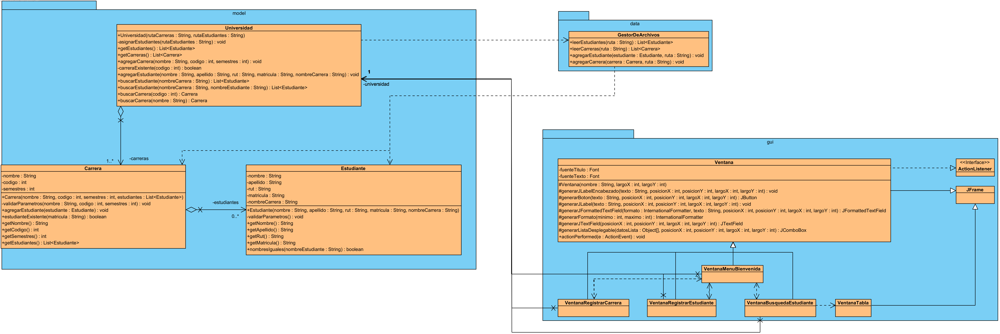

# Evidencia12: Implementación de interfaces gráficas de usuario

### Objetivo: 
Esta es una actividad para repasar los contenidos de POO, generación de interfaces gráficas y gestión de bases de datos.

### Caso: 
Se quiere modelar computacionalmente a los estudiantes de la UFRO para desarrollar una aplicación con POO e interfaces gráficas para la Intranet.
- Se considera que un estudiante queda definido por: nombre, apellido, rut, número de matrícula.
- La clase Estudiante considera:
  1. constructores con y sin parámetros.
  1. conjunto de setter/getter para sus atributos.
- La clase Carrera está formada por un conjunto de estudiantes, los cuales son gestionados a través de un ArrayList.
- Una carrera debe considerar como mínimo, el nombre de la carrera, un código y la cantidad de semestres que contiene.
- Una Carrera puede agregar y eliminar objetos de tipo estudiante (considerando las validaciones necesarias).
  
- Para las ventanas gráficas, se inicia un menú principal que permite registrar carrera y registrar estudiantes.

## Diagrama de Clases
